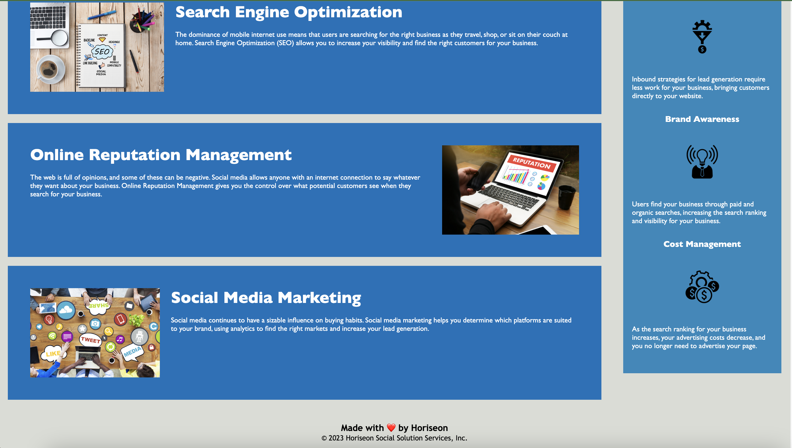

# Module 1 Challenge:

# HTML CSS Git Challenge: Code Refactor

This challenge was to clean up the html code of html and css code of a working webpage, to make the page optimized for search engines, and to bring the page up to accessibility standards with alt attributes.

## Installation

In order to get the full experience, users must open "inspect" to view the html semantic elements and alt tags, after admiring how well it still functions.

## Usage

PLease visit the page at this [link.](https://tayskully.github.io/horiseon-challenge/)

You may scroll up and down on this page, click the links to jump to the content you crave. The page should look like this:

## Credits

The collaborators on this project include me, myself, and Taylor
@tayskully

The code was sourced for the code refracting challenge from https://github.com/coding-boot-camp/urban-octo-telegram

Tutorials followed include Columbia University EdX's Coding Bootcamp 2023, as well as:  
 [Github Docs](https://docs.github.com/en)  
 [developer mozilla](https://developer.mozilla.org/en-US/)  
 [Dev.to](https://dev.to/)  
 [Code Academy blogs](https://www.codecademy.com/resources/blog/)  
 [W3 Schools] (https://www.w3schools.com/)

---

## Badges

